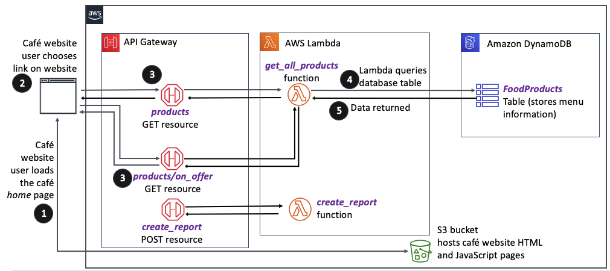

# Creating Lambda Functions Using the AWS SDK for Python

Major three milestones:

- The first milestone was to create a database backend to store café data. She accomplished that in the DynamoDB lab.
- The second milestone was to create a REST API so that the webpage hosted on Amazon S3 could interact with mock data. She completed the most difficult part of that task during the API Gateway lab.
- The third milestone was to create Lambda functions to query the DynamoDB table or index, or return a static message, and then to update the REST API resources to initiate the respective Lambda functions.

Architecture:

